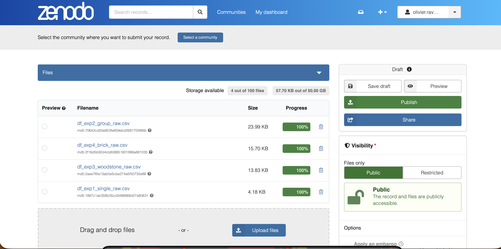
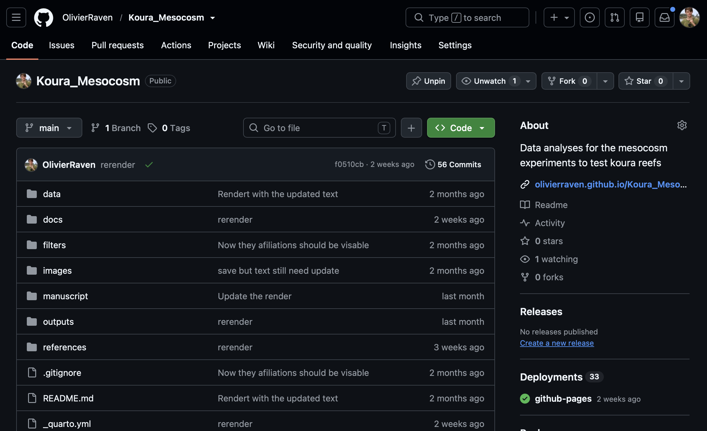

## Why does this matter? {background-color="#2E7D6B" color="white"}

::: {.pull-stat}
"Wait — which script made this number again?"
:::

::: {.pull-stat-caption}
Six months after submission. Sound familiar?
:::

. . .

::: {.incremental}
- Journals increasingly **require** data availability statements
- Reviewers increasingly **check** that analyses are reproducible
- Funders increasingly **mandate** open data
:::

. . .

**The problem:** nobody teaches you *how* to actually do this

---

## The tools {background-color="#1a1a2e" color="white"}

| Tool | Purpose |
|---|---|
| **Quarto** | Write manuscript + analysis together |
| **Positron** | IDE with built-in Git support |
| **GitHub** | Host code, give reviewers access |
| **renv** | Record exact R package versions |
| **Zenodo** | Permanent archive + citable DOI |

. . .

All free. All open source.

---

## More than just organisation {background-color="#f8f9fa"}

::: {.point-cards}
::: {.point-card}
**LaTeX typesetting**
PDF renders through LaTeX — proper academic layout immediately, not a fight with Word's page formatting
:::

::: {.point-card}
**One-line CSL swap**
Reformats every citation to match any journal's house style — no manual reformatting
:::

::: {.point-card}
**Structured metadata**
ORCID iDs, affiliations, funding statements flow straight into the rendered output
:::
:::

. . .

Change the journal, change one line. Not a re-format.

---

## The two-file approach {background-color="#f8f9fa"}

::: {.columns}
::: {.column width="50%"}
### `analysis.qmd`
All your R code

- Data cleaning
- Statistical models
- Figure & table generation
- Session info

Renders to **HTML**
:::

::: {.column width="50%"}
### `index.qmd`
Your clean manuscript

- Introduction
- Methods
- Results (figures, tables, inline stats)
- Discussion

Renders to **HTML / PDF / Word**
:::
:::

. . .

Both version controlled together on GitHub

---

## Numbers that stay in sync {background-color="#f8f9fa"}

Quarto can pull real numbers straight from your analysis into your prose — no more hand-typing a mean or p-value into the manuscript.

. . .

```{.r}
# analysis.qmd — compute it once, save what you want to report
report_stats <- list(
  mean_stone = summary_table$mean_length[summary_table$shelter_type == "stone"],
  pvalue = summary(model_preference)$coefficients[2, "Pr(>|t|)"]
)
saveRDS(report_stats, "outputs/report_stats.rds")
```

. . .

```{.markdown}
<!-- index.qmd -->
Carapace length differed significantly by shelter type
(mean stone = `r round(report_stats$mean_stone, 1)` mm,
p = `r round(report_stats$pvalue, 3)`).
```

. . .

::: {.rendered-output}
[Rendered output]{.label}
Carapace length differed significantly by shelter type (mean stone = **34.2 mm**, p = **0.003**).
:::

. . .

::: {.callout-tip appearance="simple"}
Re-render → the manuscript updates itself. Change your model, get a new number for free.
:::

---

## Day 1: Setup in Positron {background-color="#2E7D6B" color="white"}

::: {.columns}
::: {.column width="55%"}
::: {.step-list}
1. Create project folder structure
2. Source Control → **Initialize Repository**
3. Commit → **Publish to GitHub** (Public)
4. `renv::init()` + `renv::snapshot()`
5. zenodo.org → Settings → GitHub → toggle repo **ON**
:::
:::

::: {.column width="45%"}
```
my_paper/
├── _quarto.yml
├── index.qmd
├── analysis.qmd
├── data/
│   ├── raw/         # NEVER modify
│   └── derived/
├── outputs/
│   ├── figures/
│   └── tables/
├── references/
└── README.md
```
:::
:::

. . .

`.gitignore` keeps `outputs/`, raw data, and OS files out of version control — **total time: ~20 minutes**

::: {.shot-placeholder}
[📷]{.icon}
TODO: screenshot of Positron's Source Control panel here — Stage / Commit / Sync buttons, exactly as slide "Daily workflow" describes them next
:::

---

## Daily workflow

In the Positron Source Control panel:

```
Work → Stage (+) → Commit (✓) → Sync (↑)
```

. . .

::: {.good-bad}
::: {.good}
[Good commit messages]{.badge}
"added linear model for shelter preference"

"fixed figure 3 axis label"

"updated discussion after reviewer 2 comment"
:::

::: {.bad}
[Bad commit messages]{.badge}
"update"

"fix"

"changes"

"final version 3"
:::
:::

---

## Working with co-authors {background-color="#f8f9fa"}

::: {.point-cards}
::: {.point-card}
**Add as collaborators**
GitHub collaborators push commits directly, same as you
:::

::: {.point-card}
**Sync first**
Pull before you start each session to avoid conflicts
:::

::: {.point-card}
**Split by section**
Avoids two people editing the same part at once
:::

::: {.point-card}
**Branch at scale**
3+ people or experimental work → give each person a branch
:::
:::

. . .

List every co-author (with **ORCID**) on the Zenodo record — that's what makes the archived record credit everyone correctly

---

## The DOI timing problem

::: {.callout-important appearance="simple"}
You need the DOI **in the manuscript** before submission, but you do not want to **lock the version** until after revisions.
:::

. . .

**The solution:** Zenodo lets you reserve a DOI without publishing

```
Reserve DOI → submit → revise → accept → publish
     ↑                                       ↑
DOI exists                            DOI goes live
(not public yet)                   (permanently locked)
```

---

## Before submission

::: {.columns}
::: {.column width="45%"}
::: {.step-list}
1. zenodo.org → New Upload → fill metadata
2. Click **Reserve DOI** (do not publish yet)
3. Add the DOI + GitHub link to the manuscript
:::
:::

::: {.column width="55%"}
{width="100%"}
:::
:::

. . .

```
Data available at https://doi.org/10.5281/zenodo.XXXXXXX
(upon acceptance) and github.com/user/repo
```

. . .

Reviewers access code directly via the **public GitHub URL** — but many won't think to look unless you tell them:

::: {.incremental}
- Mention the links in your **cover letter**, not just the data availability statement
- Double-blind journal? Use an **Anonymous GitHub** mirror instead of your real profile
:::

---

## Licensing & keeping things secure {background-color="#f8f9fa"}

**Defaults that satisfy nearly every journal/funder:**

::: {.point-cards}
::: {.point-card}
**CC BY 4.0**
The default for data — reuse allowed, attribution required
:::

::: {.point-card}
**MIT**
The default for code — permissive, minimal restrictions
:::

::: {.point-card}
**CC BY-NC**
Blocks commercial use, if that matters for your work
:::

::: {.point-card}
**GPL**
Keeps derivatives open-source too
:::
:::

. . .

**A license controls reuse, not access** — it doesn't hide anything

. . .

::: {.callout-important appearance="simple"}
Sensitive data (privacy, sovereignty, endangered species locations)? Use Zenodo's **access right** setting: Open, Embargoed, or **Restricted** (metadata public, files require your approval) — not a stricter license.
:::

---

## After acceptance {background-color="#2E7D6B" color="white"}

::: {.columns}
::: {.column width="42%"}
::: {.step-list}
1. Final commit: `"final version — accepted by [Journal]"`
2. Sync to GitHub
3. GitHub → Releases → **Create release** → tag `v1.0`
4. zenodo.org → find draft → **Publish**
5. Update data availability statement
:::
:::

::: {.column width="58%"}
{width="100%"}
:::
:::

. . .

**Zenodo automatically archives the release and locks the DOI**

---

## What you get {background-color="#1a1a2e" color="white"}

::: {.check-list}
- Complete version history of every decision
- Permanent, citable DOI for code and data
- Fully reproducible analysis
- Reviewer access without extra effort
- Manuscript produced directly from the same code
:::

---

## Where this goes next: living papers {background-color="#1a1a2e" color="white"}

::: {.incremental}
- Today, this workflow ends at acceptance — one archive, done
- A **living paper** keeps evolving after that point, without ever touching what's already published
:::

. . .

::: {.pull-stat}
The published DOI never moves.
:::

::: {.pull-stat-caption}
That's not a limitation — it's the anchor everything else hangs off.
:::

---

## The mechanism: concept DOI vs. version DOI

```
v1.0 (published)  →  v1.1 (correction)  →  v1.2 (new data)
       │                    │                    │
   its own DOI          its own DOI          its own DOI
  (frozen forever)     (frozen forever)     (frozen forever)
       └────────────────────┴────────────────────┘
                same concept DOI throughout
            (always resolves to the latest version)
```

. . .

v1.0 stays exactly what your published paper cites — forever. Everything after it is a forward-only trail, not a revision.

---

## What "living" could mean in practice {background-color="#f8f9fa"}

::: {.mini-flow}

::: {.step}
Missing `renv.lock` → **v1.1**
:::

[→]{.arrow}

::: {.step}
Reviewer question answered → **v1.2**
:::

[→]{.arrow}

::: {.step}
Next season's data → **v1.3**
:::

:::

. . .

A CI badge: **"last verified reproducible: [date]"** — a live claim, not a static one

. . .

::: {.callout-tip appearance="simple"}
The hard call isn't technical — it's deciding when a change is a new version of this paper versus when it's actually a new paper.
:::

---

## Further resources {background-color="#f8f9fa"}

Full guide: **scienceecosystem.org/open-research-workflow**

- Le Foll (2026): Quarto for Reproducible Research
- blenback: R for Reproducible Research
- SIB Swiss: Make Your Research FAIRer

. . .

This presentation itself follows the workflow it describes.

**Source:** github.com/OlivierRaven/Open_Research_Workflow

---

## Questions? {background-color="#2E7D6B" color="white" text-align="center"}

::: {.text-center}
**Olivier V. Raven**

University of Waikato | ScienceEcosystem.org

[scienceecosystem.org/open-research-workflow](https://scienceecosystem.org/open-research-workflow)
:::
